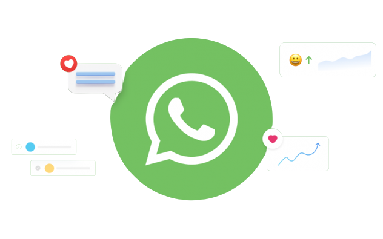

<h1 align="center">


  <br>
 

  <a href="https://imtaqin.id"> </a>
  
# Whatsapp Cloud API Wrapper
[](https://opensource.org/licenses/Artistic-2.0)
[](https://badge.fury.io/js/discord.js)[](https://github.com/ellerbrock/open-source-badges/)


 This library is a Node.js wrapper for the Whatsapp Cloud API. It simplifies the process of interacting with the API by handling request and response formatting, authentication, and providing easy-to-use methods for common API operations.

 (Give star if you like it :) 

## Features

-   Easy to use and configure
-   Supports sending and replying to text, image, audio, and document messages
-   Supports setting up webhook servers for receiving events
-   Built-in support for ngrok
-   Automatically handles authentication and access tokens
-  Automatically identify the webhook type data like Notification or Message

## Installation

You can install the package using npm or Yarn:

```bash
npm install wacloudapi
```
or

```bash
yarn add wacloudapi
```
## Usage

First, import the required classes from the package:


```javascript
const { Message, WAParser, WebhookServer } = require('wacloudapi);
```

### Sending Messages

Create a new `Message` instance with your API credentials:

```javascript
const message = new Message(apiVersion, phoneNumberId, accessToken);
```


You can now use the various methods provided by the `Message` class to send messages:


```javascript
message.sendTextMessage(recipientPhoneNumber, messageContent);
```

### Webhook Server

Create a new `WebhookServer` instance and specify the desired port and whether to use ngrok:

```javascript
const webhookServer = new WebhookServer(port, useNgrok, ngrokAuthToken);
```

Add a listener for incoming messages:

```javascript
webhookServer.on('message', (message) => {
  console.log('Received message:', message);
});
```

Add a route for webhook verification:

```javascript
webhookServer.Verification(callbackUrl, verificationToken);
```
Start the webhook server:

```javascript
webhookServer.start();
```

## Webhook Parser

The `WAParser` class is used to parse incoming webhook data from the WhatsApp Business API.


#### parseMessage()

Returns the parsed message object depending on the type of message contained in the received webhook data.
```javascript
const parse = new WAParser(WebhookData);
  // parse message
const parsedMessage = parse.parseMessage();
```
## Notification Parser

The `NotificationParser` class is used to parse incoming webhook data from the WhatsApp Business API.


#### NotificationParser()

Returns the parsed message object depending on the type of message contained in the received webhook data.
```javascript
const parse = new NotificationParser(WebhookData);
  // parse message
const parsedMessage = parse.parseNotification();
```

## Documentation

For detailed information on available methods and how to use them, please refer to the [documentation](/docs).

## Contributing

Contributions are welcome! If you'd like to contribute, please follow these steps:

1.  Fork the repository
2.  Create a new branch with your changes
3.  Commit your changes and create a pull request

We appreciate any help and feedback!

## License

This project is licensed under the MIT License. See the [LICENSE](/LICENSE) file for more information.
